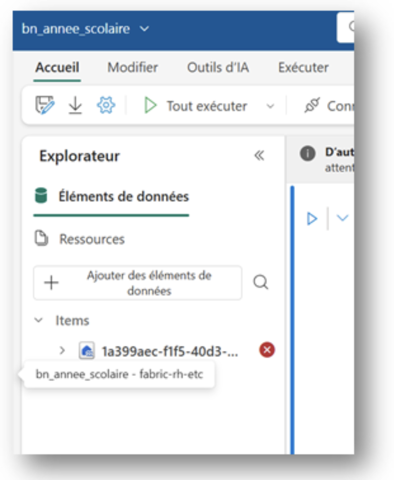

# fabric-rh-etc
## Requis pour utiliser ce projet

Un environnement Microsoft Fabric
Il faut mettre en place le projet core_fabric (https://github.com/CDPVD/core_fabric)

## Ce que ce module fait

 

Nous avons deux bloc-notes Fabric.

Le premier est pour la création d’une table des années scolaire et d’y inscrire les cibles du nombre d’ETC.

Le deuxième bloc-notes est pour prendre tous les fichiers CSV de Percos (généré par le système de Paie lors d’une production de paie via l’outil Calcul des effectifs de la Grics) et de les mettre dans une table. 

Aucun traitement de données n’est fait autre que de mettre l’année scolaire et de mettre une catégorie de corp d’emploi (Gestionnaire, professionnel, enseignant…)

## Mettre en place le tableau de bord ETC 

 <ol>
<li>Dans votre Fabric, créez un espace de travail et nommez le "fabric-rh-etc" (ce nom n’est pas une suggestion, il faut vraiment créer cet espace avec ce nom). 

&nbsp;&nbsp;&nbsp;&nbsp;&nbsp;

<li>Une fois l’environnement créé, dans le haut à droite, cliquez sur "Paramètres de l’espace de travail"
  
&nbsp;&nbsp;&nbsp;&nbsp;&nbsp;

<li>Allez sur Intégration de Git et sélectionnez GitHub

&nbsp;&nbsp;&nbsp;&nbsp;&nbsp;
 

<li>Une fois connecté sur Git, inscrivez le repo : "CDPVD/fabric-rh-etc", sur la branche main.

&nbsp;&nbsp;&nbsp;&nbsp;&nbsp;
 

<li>En cliquant sur « Connexion et synchronisation » tout le nécessaire pour faire fonctionner les interfaces de Paie.

 

<li>Dans le dossier "lac de donnée", allez dans le lac de données « Bronze »

&nbsp;&nbsp;&nbsp;&nbsp;&nbsp;
 

<li>Dans la section "Fichiers", aller créer un dossier "etc". C’est le dossier dans lequel vous devrez aller téléverser les fichiers CSV de PERCOS qui sont générés à chaque génération de paie. Pour avoir ces fichiers, référez-vous à votre personne aux ressources humaines.
  
&nbsp;&nbsp;&nbsp;&nbsp;&nbsp;  
&nbsp;&nbsp;&nbsp;&nbsp;&nbsp;
  
 
<li>Allez dans le bloc note « bn_annee_scolaire » dans le dossier "bloc-notes" et vérifiez si les "éléments de donnes" est bien configuré.

&nbsp;&nbsp;&nbsp;&nbsp;&nbsp;

<li>Si vous ne voyez qu’une séquence de chiffres et lettre, c’est que la configuration n’est pas bonne. Cliquez sur "Ajouter des éléments de données" et sélectionnez "Sources de données existants"

  &nbsp;&nbsp;&nbsp;&nbsp;&nbsp;
 

<li>Il faut sélectionner le LakeHouse "Or" de l’environnement de données actuel. Faire un clique droit et le mettre par défaut.
  

&nbsp;&nbsp;&nbsp;&nbsp;&nbsp;
 

<li>Une fois le LakeHouse connecté, allez modifier la ligne cibles_Ministere et inscrivez les cibles que votre direction général ou DRH vous donnera. Une fois, vos cibles inscrites, allez cliquer sur le bouton "Tout exécuter".

&nbsp;&nbsp;&nbsp;&nbsp;&nbsp;
 

<li>llez dans le bloc note "bn_traitement_etc" dans le dossier "bloc-notes" et vérifiez si les "éléments de donnes" est bien configuré.
  &nbsp;&nbsp;&nbsp;&nbsp;&nbsp; 
 

<li>Si vous ne voyez qu’une séquence de chiffres et lettre, c’est que la configuration n’est pas bonne. Cliquez sur "Ajouter des éléments de données" et sélectionnez "Sources de données existants"
 
  &nbsp;&nbsp;&nbsp;&nbsp;&nbsp;
 

<li>Il faut sélectionner le LakeHouse "Or" et "Bronze" de l’environnement de données actuel. Faire un clique droit sur "Or" et le mettre par défaut.

   &nbsp;&nbsp;&nbsp;&nbsp;&nbsp;

 
<li>Une fois le LakeHouse connecté, cliquer sur le bouton "Tout exécuter".

</ol>

  
 
 
 
